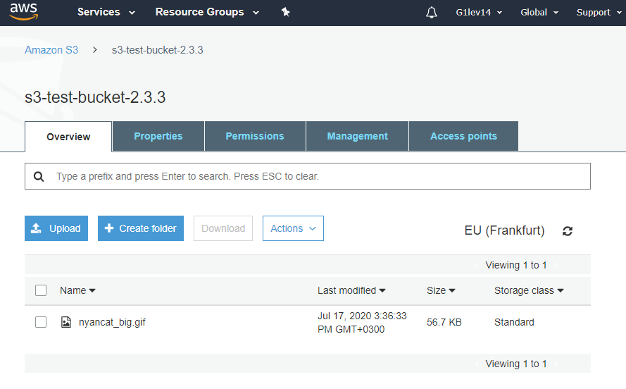
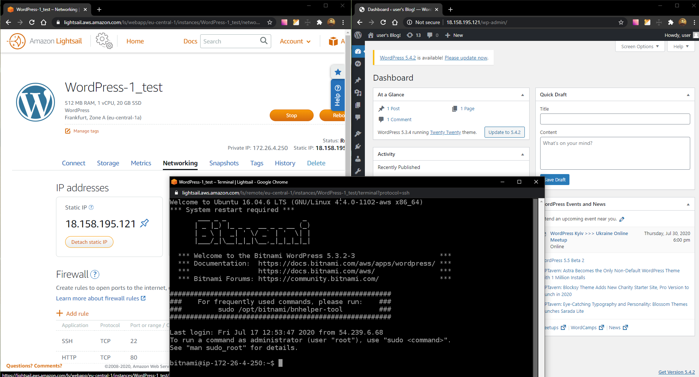
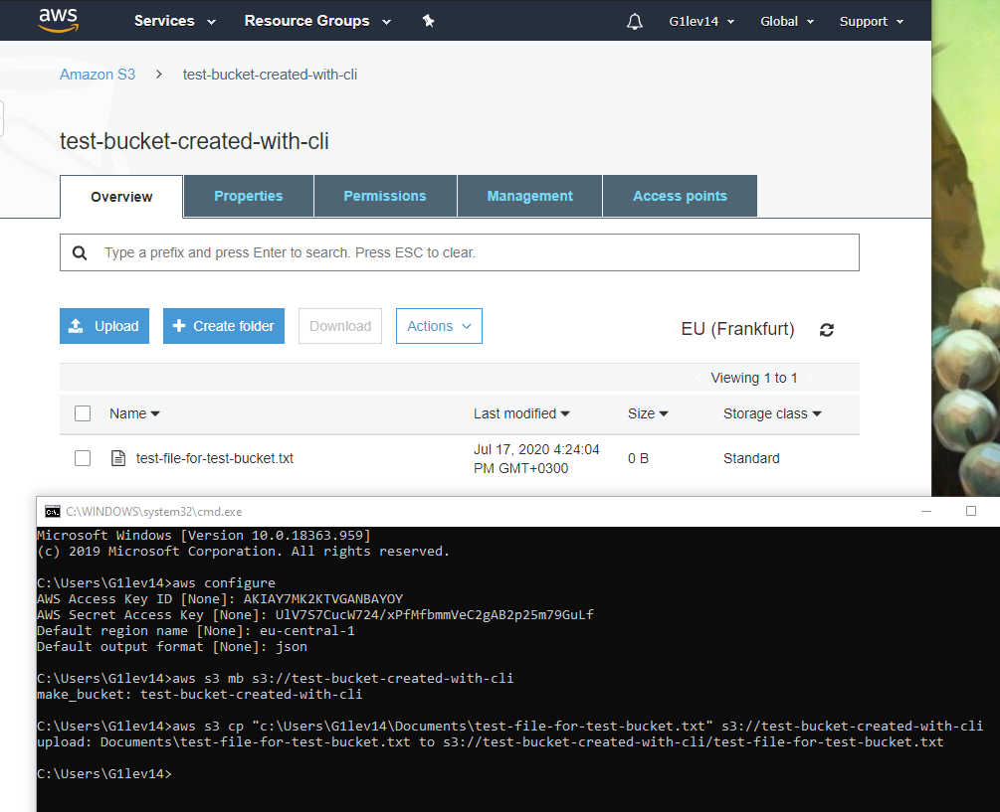

## Task 2.3

[link to final result](https://s3.eu-central-1.amazonaws.com/s3-test-bucket-2.3.3/index.html)

**Lightsail instance:**

**S3 bucket:**

**Lightsail WordPress instance with static IP:**

**S3 bucket CLI:***
