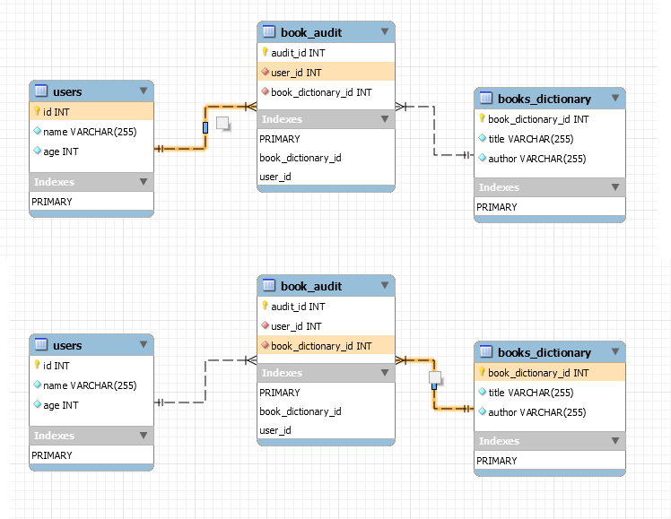
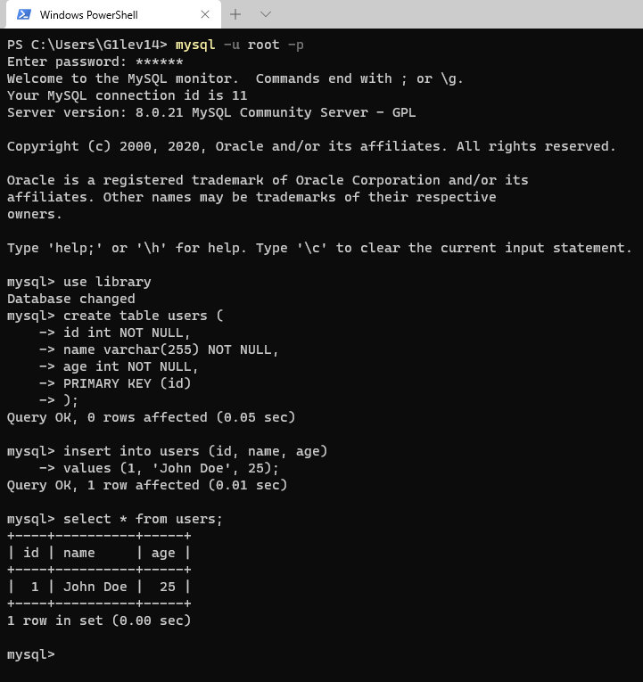
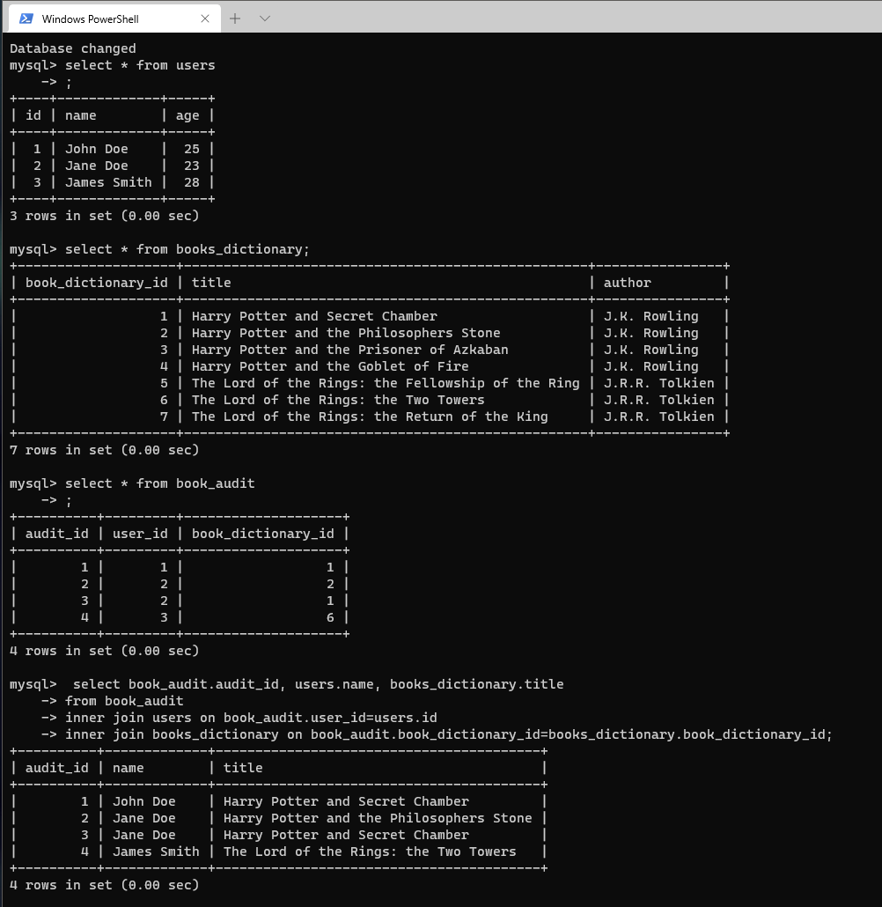
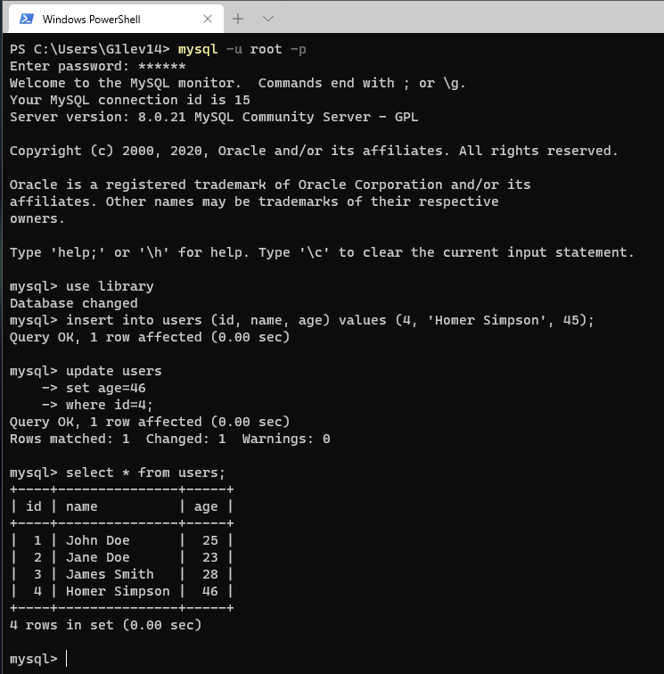
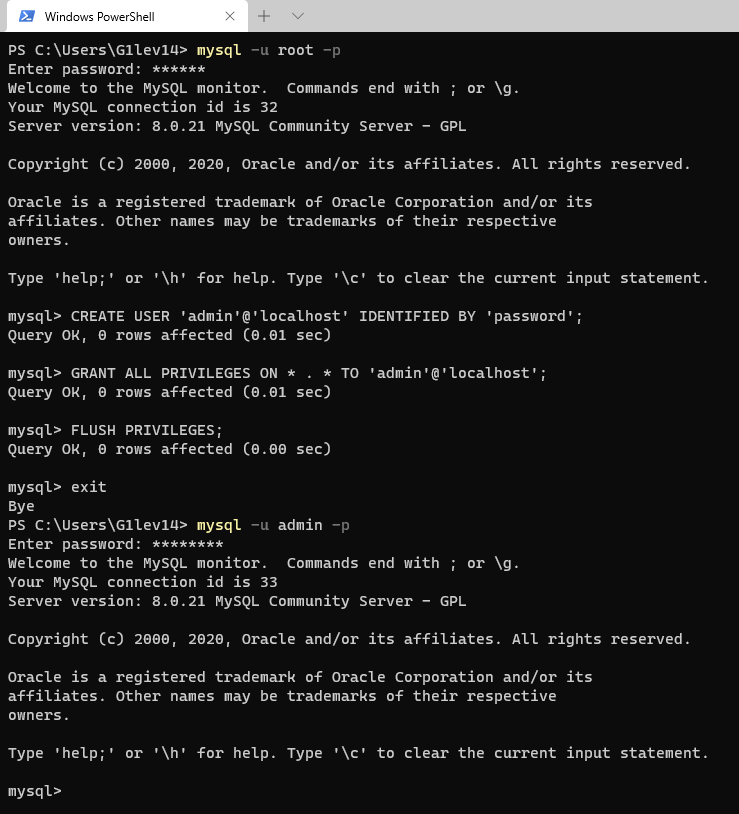
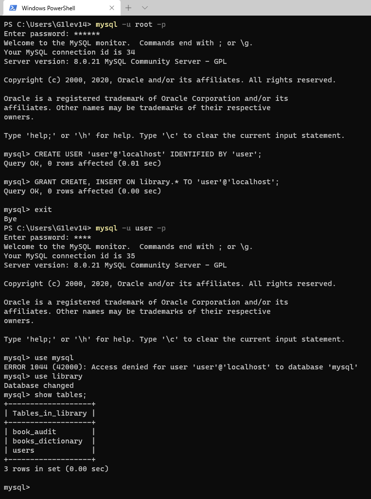
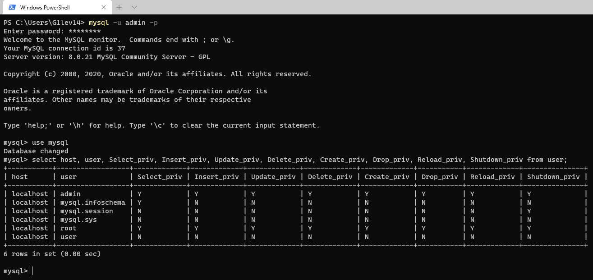
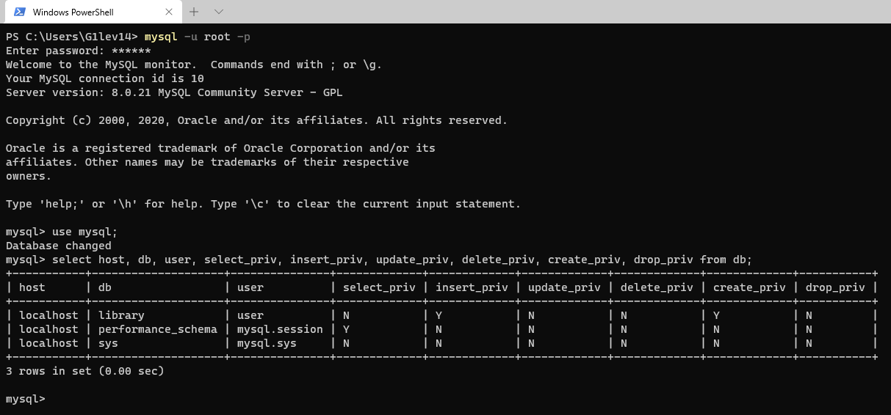

## Task 3.1

**Scheme of the DB:**

Our DB emulates a simple library. We have 3 tables `users`, `books_dictionary` and `book_audit`. Connections between tables are presented at the screenshot.
`users` - consist of id, name, age.
`books_dictionary` - list of all books available in the library, consists of id, title, author.
`book_audit` - registry with information about what user has taken which books, consist of id, user_id, book_id.

**Creating tables and filling them with information:**

**Data from all tables:**

As we can see table `book_audit` has only numbers in default view, so we can use 'join' to make it more presentable.

**Manipulations with table data:**

**Users and privileges:**

As we can see user 'admin' has ALL PRIVILEGES on all DBs and tables, and user 'user' has CREATE and INSERT privileges but only on 'library'.

**Another selection and demonstrations of different users and privileges:**

 
