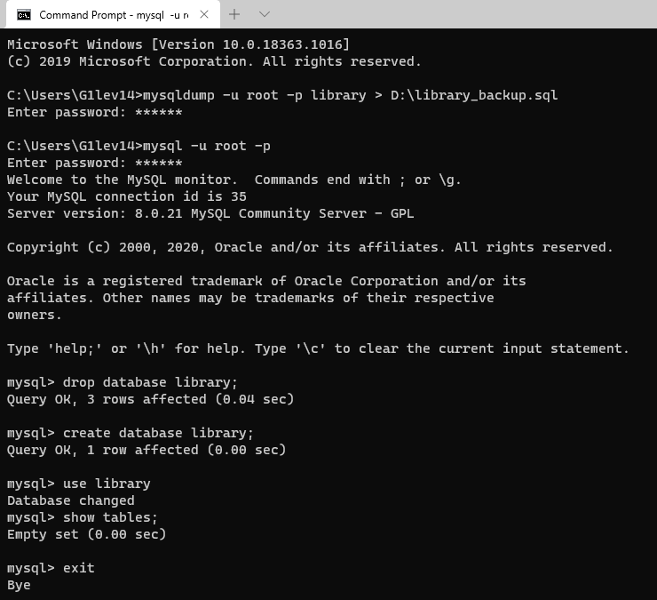
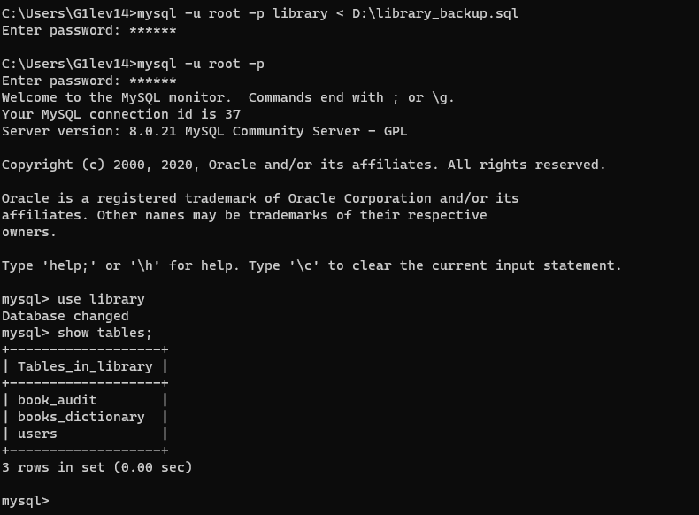
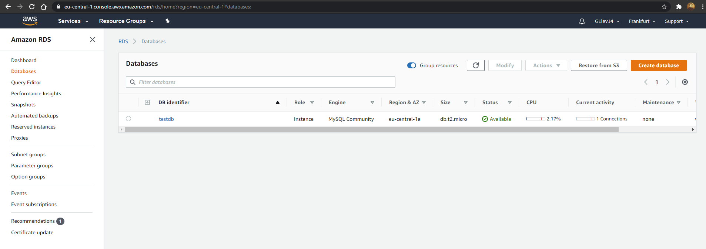
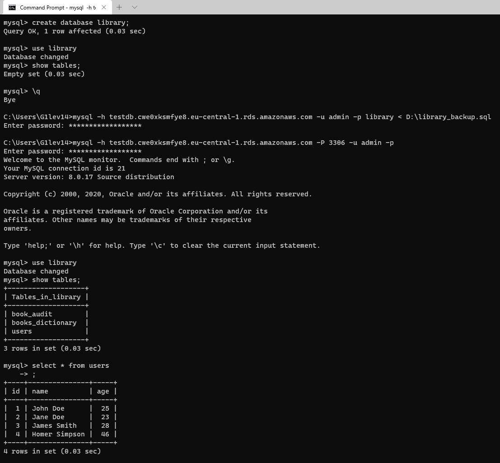

## Task 3.2

**Creating local backup:**

After backing up we can delete our DB, create empy one and make shure that it has no tables.

**Restoring from local backup:**

Cheking if all tables are present.

**Creating RDS instance:**

**Restoring local backup into the cloud:**

Connect, create empy DB, restore local bacupd, make shure that backup transfered correctly and all tables and data are present.