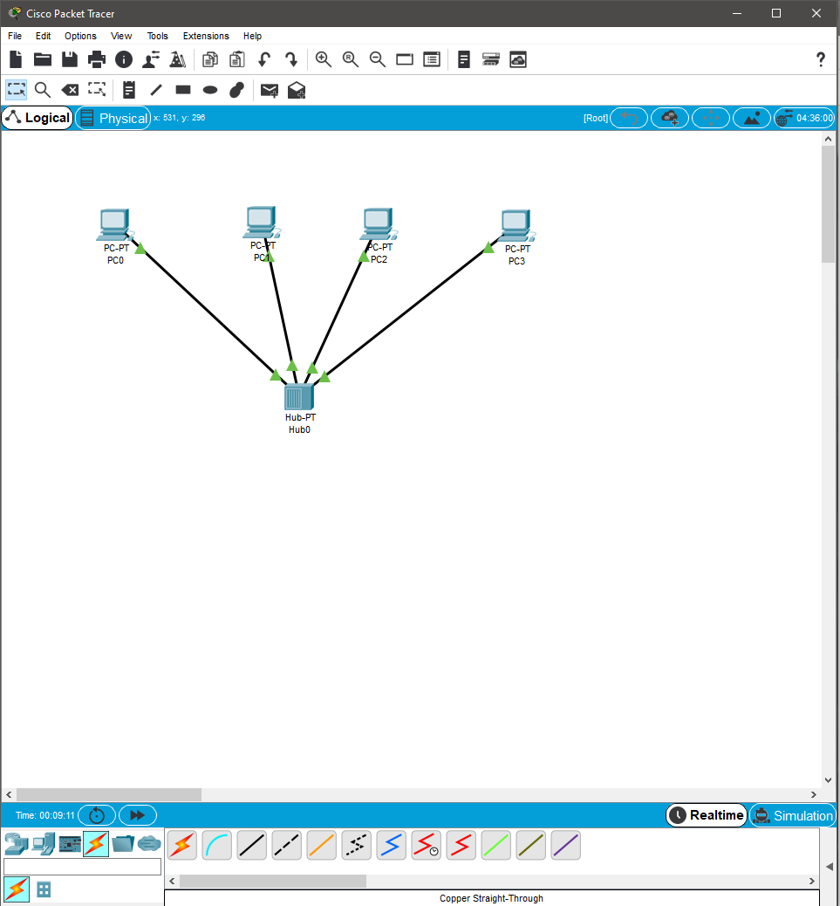
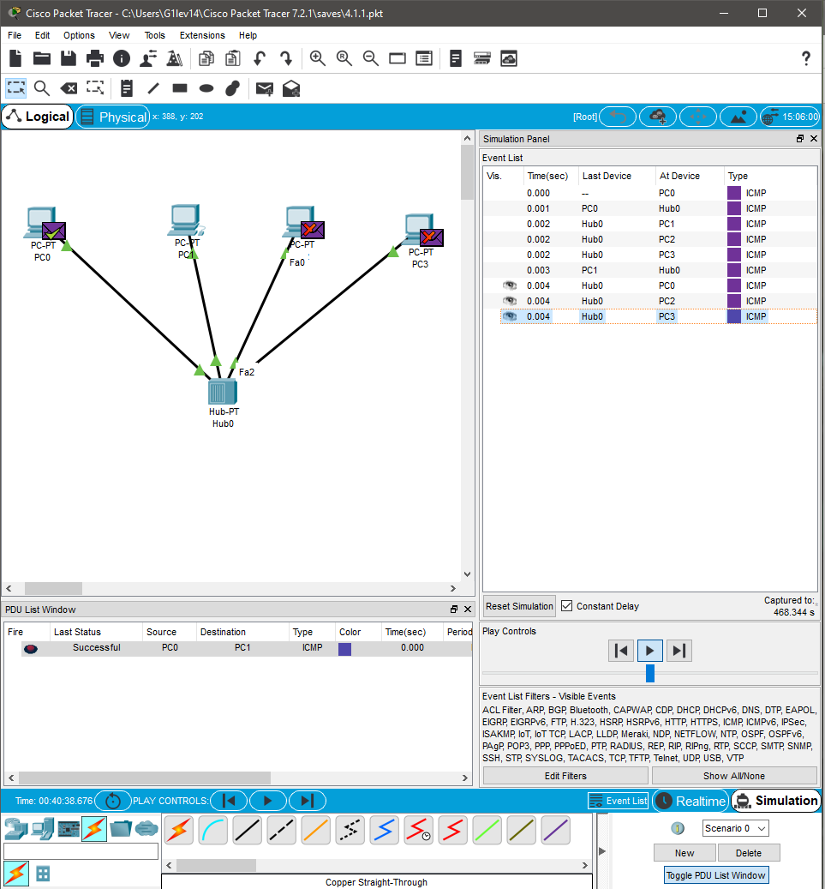
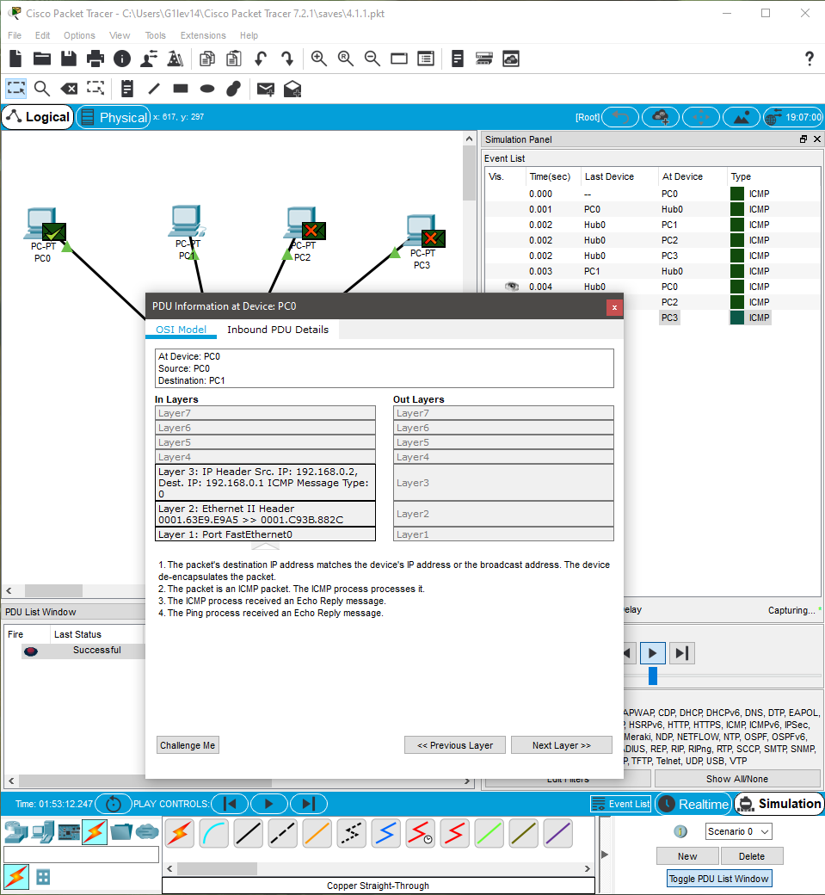
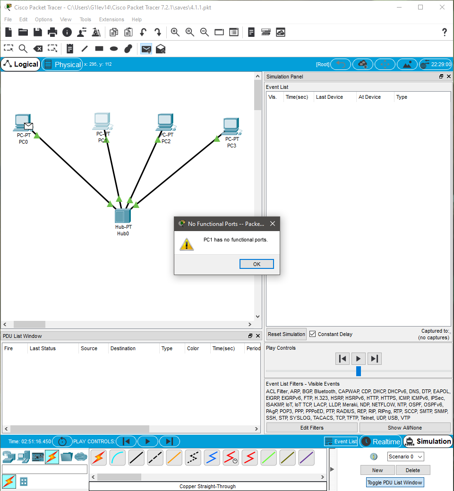
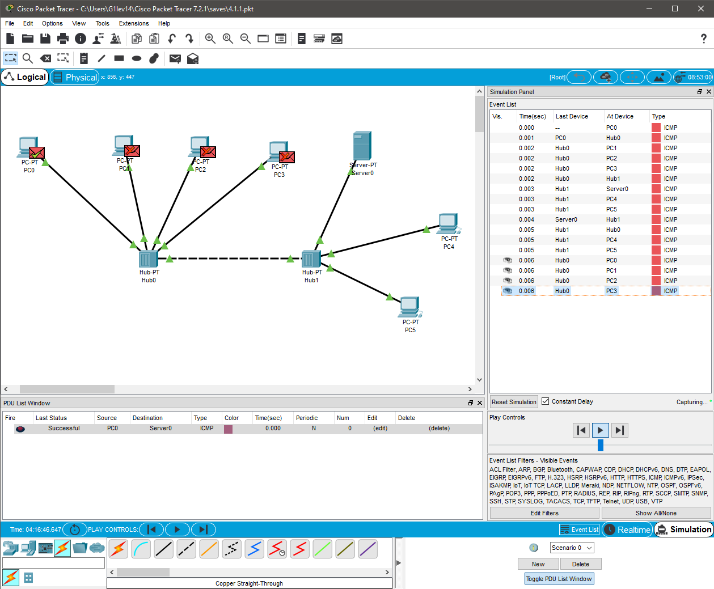
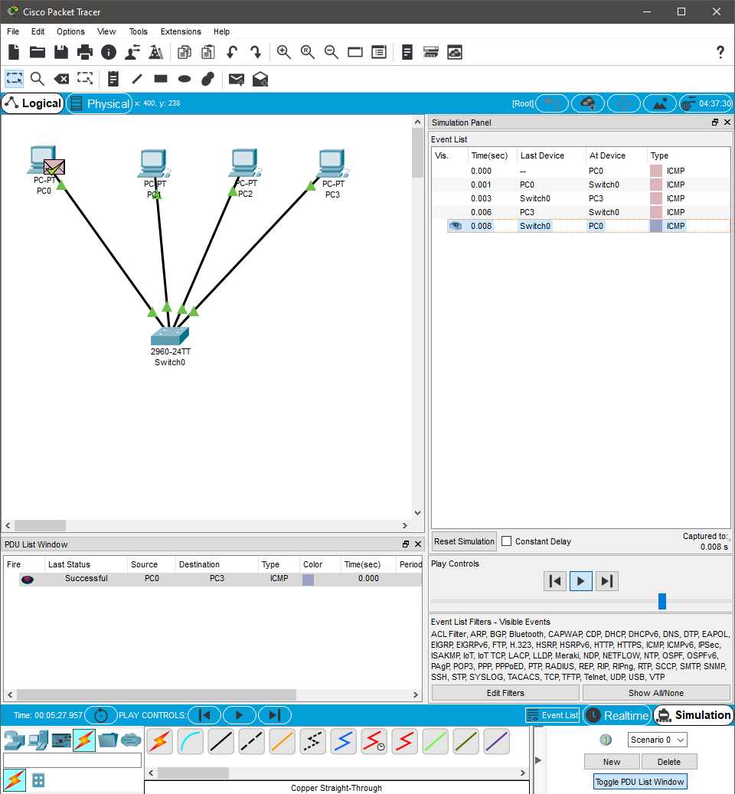
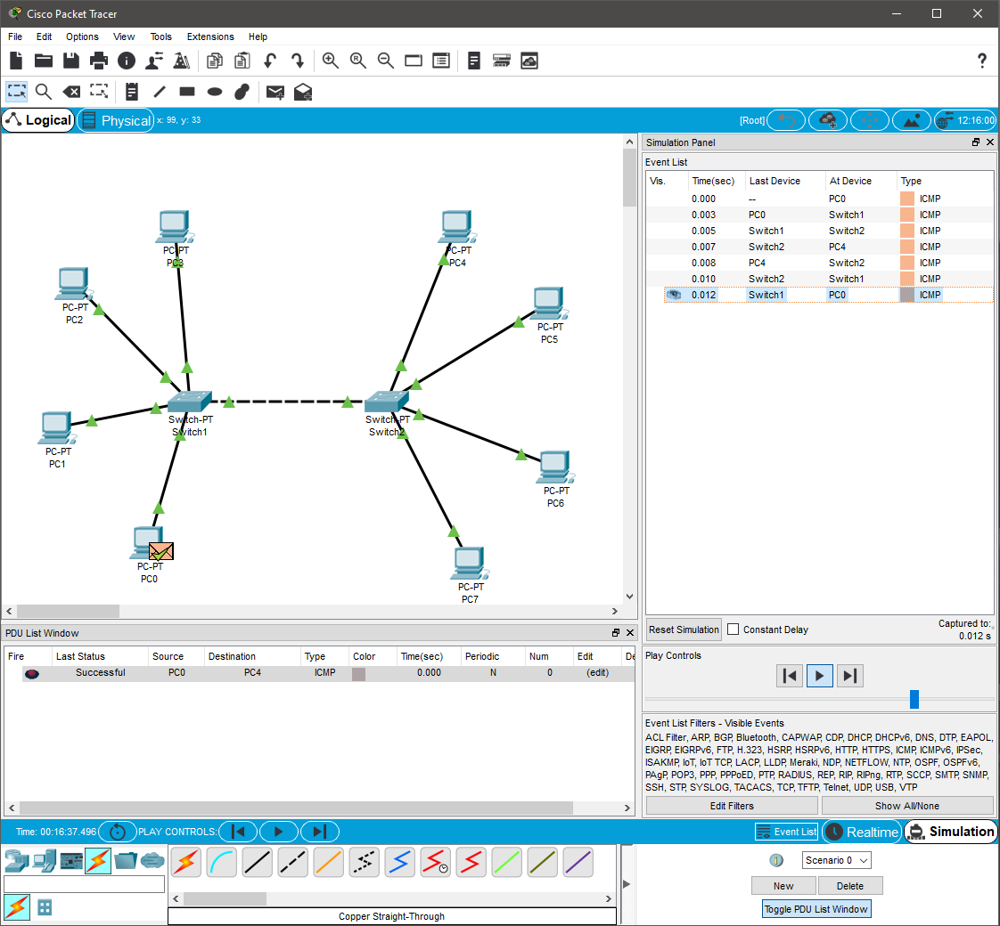
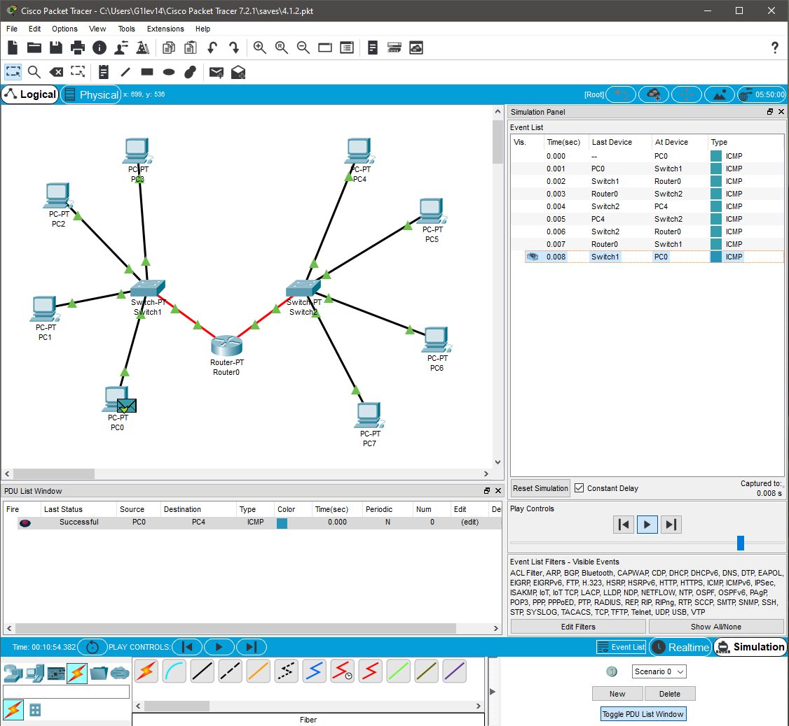

## Task 4.1

**Network with hub:**

**Network is working, hub sends packages to all devices:**

**OSI model information:**

**After removing IP addresses network is not functioning:**

**Network with 2 hubs:**

**Network with switch: packets send only to the destination device**

**Network with 2 switches:**

**Network with 2 switches and router:**
