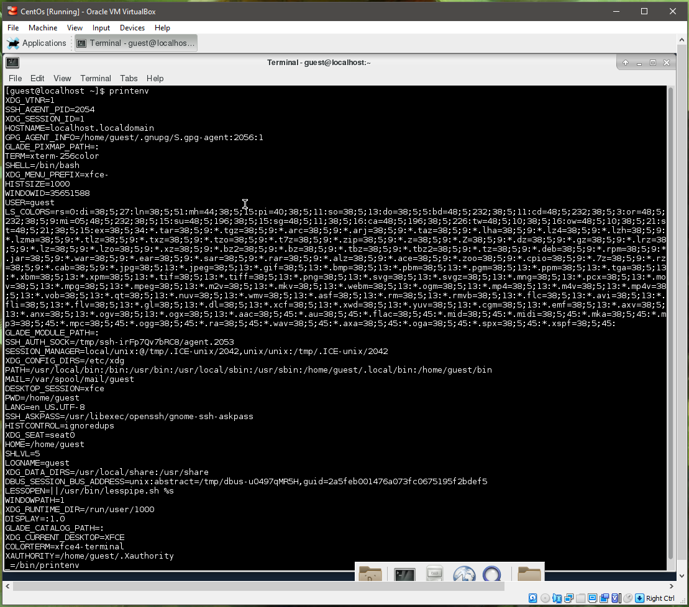
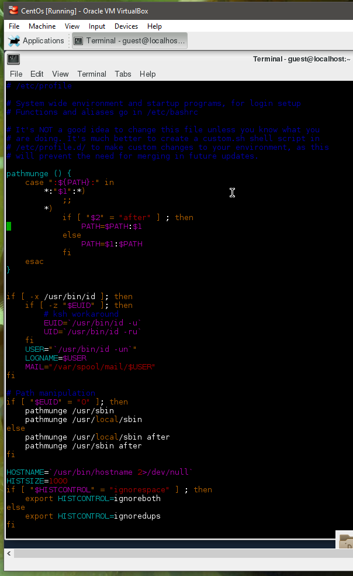
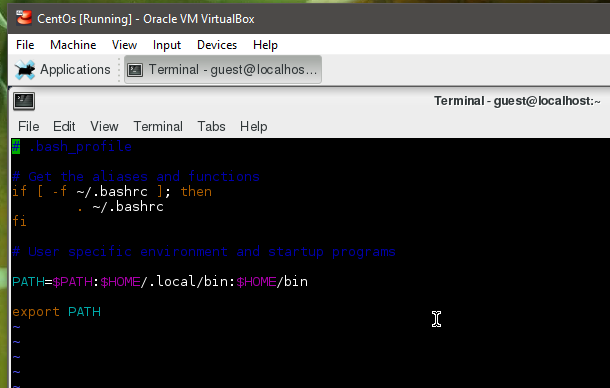
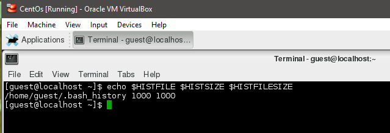
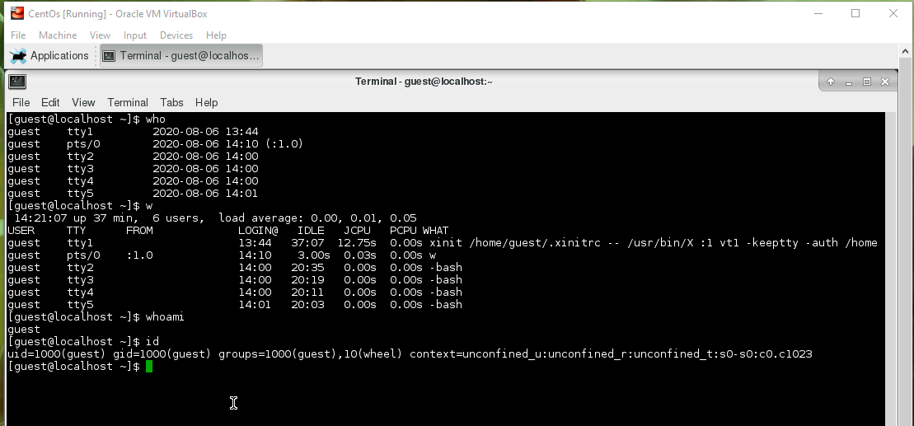

## Task 5.1

**Output of `printenv`:**

**Content of `etc/profile`:**

**Content of `~/.bash_profile`:**

**Output of `echo $HISTFILE $HISTSIZE $HISTFILESIZE`:**

**Output of `who, w, whoami,id`:**
