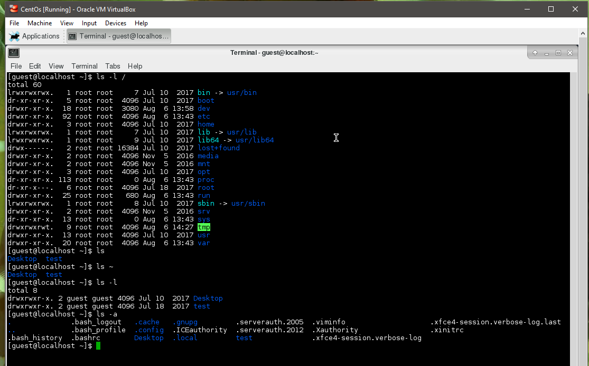
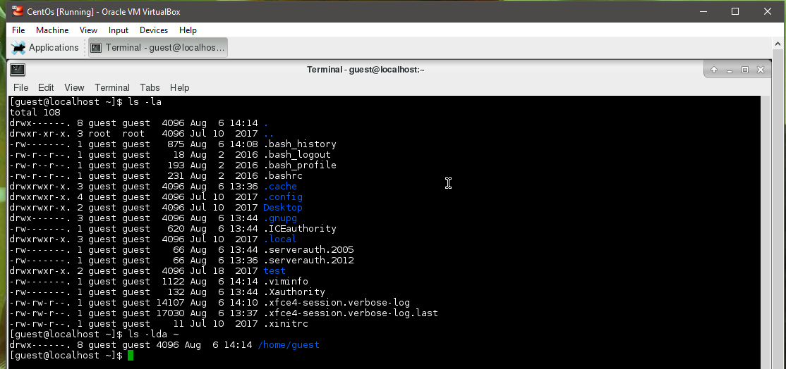
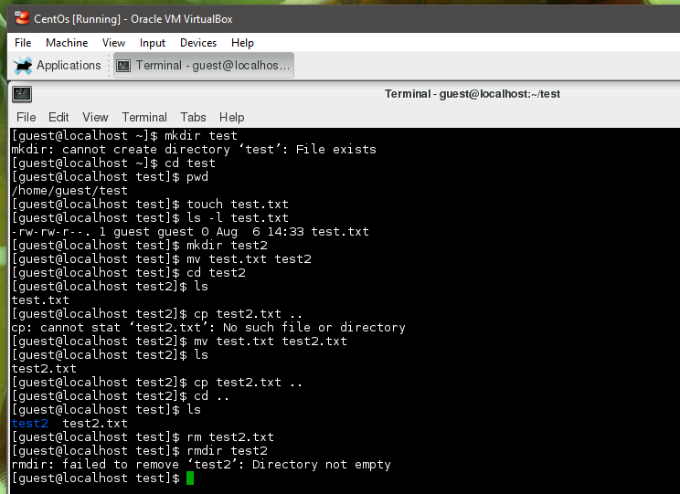
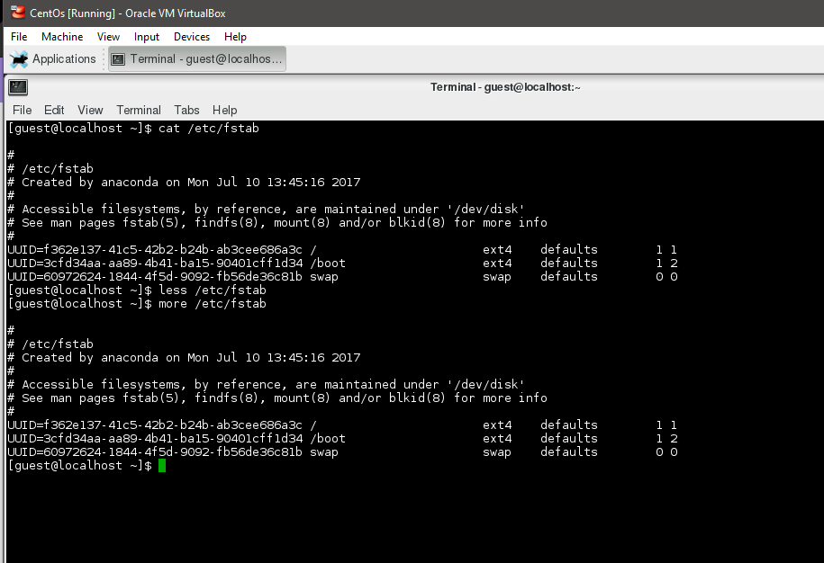

## Task 5.2

**Output of `ls` command with different flags:**

`ls` - list directory contents

`ls -l /` - show content of root directory using long listing format

`ls ~` - show content of home folder

`ls -a` - show ALL, do not ignore entries starting with dot

`ls -la` - combine of ALL and long listing format

`ls -lda ~` - adds  -d flag : list directory entries instead of contents

**Output of commands:**

`mkdir test` - creating new folder called "test"

`cd test` - change directory to newly created folder

`pwd` - show current working directory

`touch test.txt` - create new empty txt file named "test"

`ls -l test.txt` - long list format info about file

`mkdir test2` - creating new folder called "test2"

`mv test.txt test2` - move file "test.txt" to the "test2" directory

`cd test2` - change directory to "test2"

`ls` - show content of the folder

`mv test.txt test2.txt` - rename file "test.txt" into "test2.txt"

`cp test2.txt ..` - coppy file "test2.txt" from current filder to one up higher in foler structure

`cd ..` - change directory to one up higher in folder structure

`rm test2.txt` - remove file "test2.txt"

`rmdir test2` - remove folder "test2"

**Output of `cat` `more` `less` of `/etc/fstab`:**

`cat` - displays the content on to the output terminal

`more` - displays the content of the file one screen at a time for large files

`less` - is similar to the 'more' but provides extensive features
