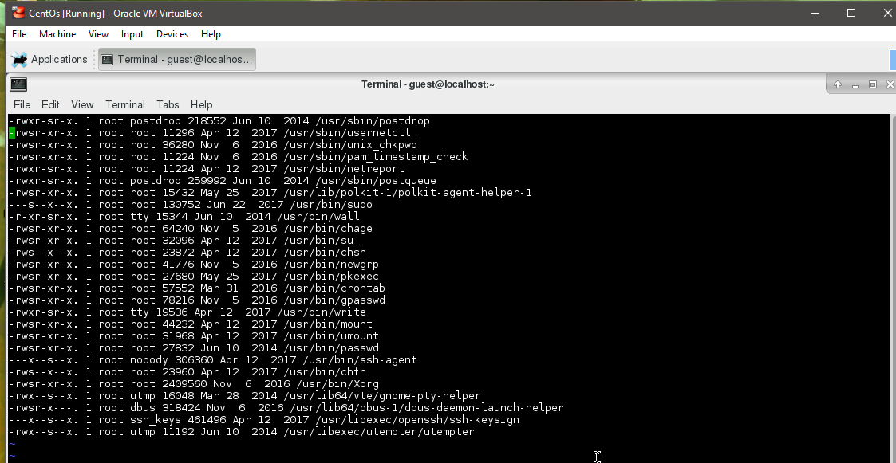
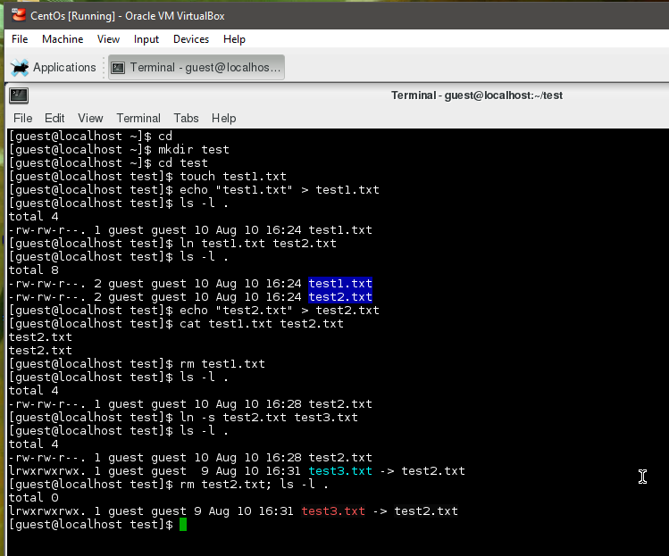
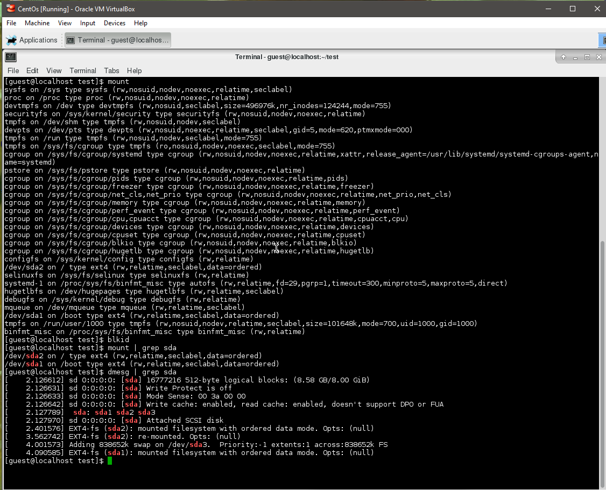

##Task 5.3
**Setuid.txt:**

`sudo find / -perm /6000 -type f -exec ls -ld {} \;>setuid.txt`
`-perm /6000` - search files with permissions bits that equals 6000
`-type f` - regular file
`-exec ls -ld {}` - execute command 'ls -ld' but its run from the subdirectory containing the matched file

**Soft and hard links:**

As seen on screenshot above we created a hard link "test2.txt" to "test1.txt". Also we created a soft link "test3.txt" to "test2.txt". After deleting original "test2.txt" file we have broken link.

**Output of commands:**

`mount` - list of mounted filesystems
`blkid` - locate/print block device attributes
`mount | grep sda` - output of mount command which contains 'sda'
`dmesg | grep sda` - print or control the kernel ring buffer filtered by 'sda'
`sudo grep -R -e` - '-R' Read all files under each directory recursively, follow all symbolic links. '-e' pattern. So we search all "root" entries in '/etc' directory 