## Task 5.4

**Creating a new user:**

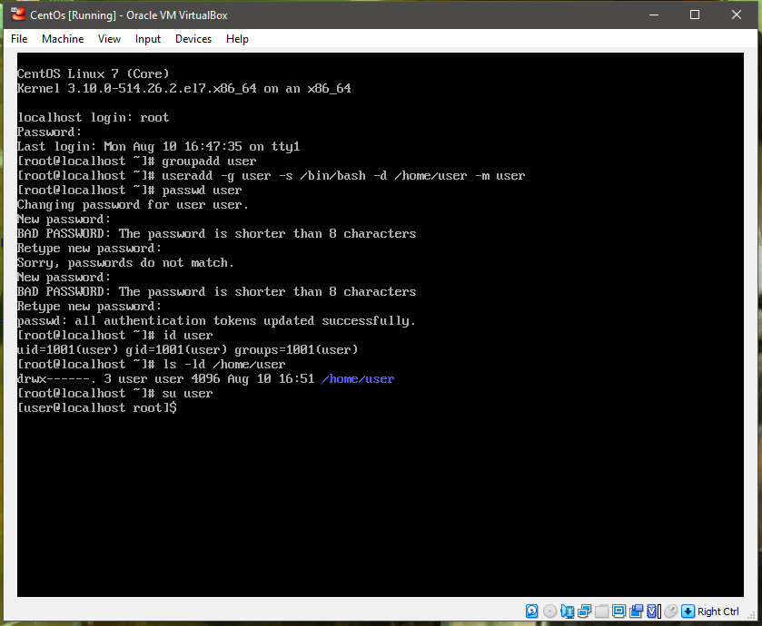

**User prevented from login into the system:**

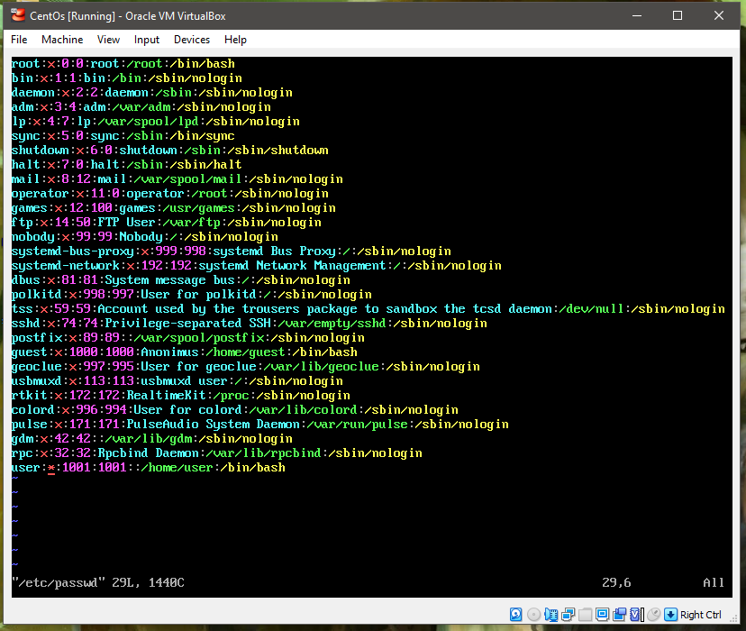

**/etc/passwd :**

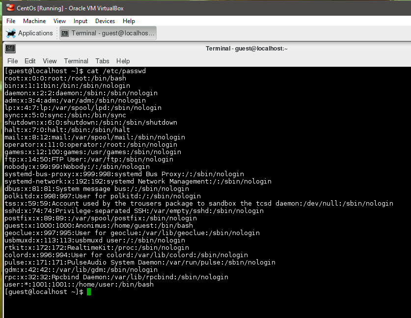

**/etc/group :**

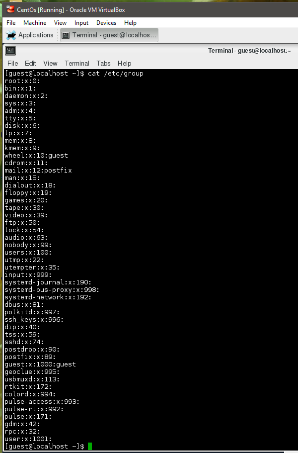

**Filtered information :**

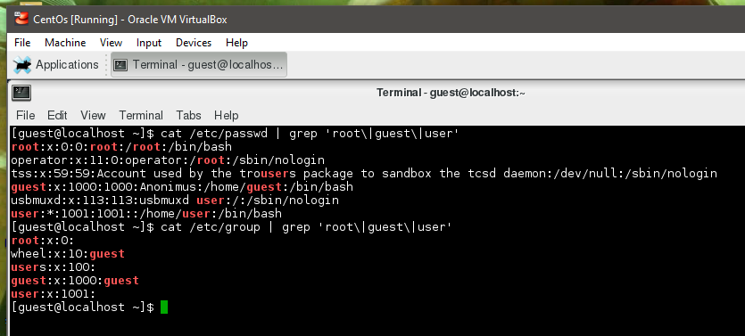

**Parsed :**

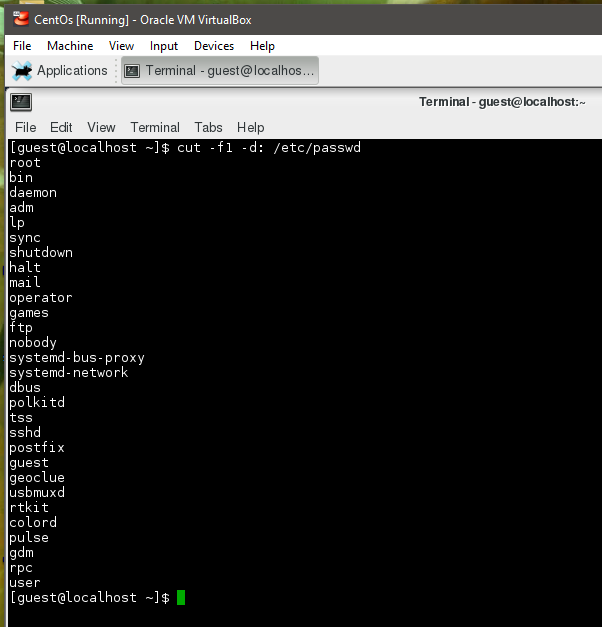
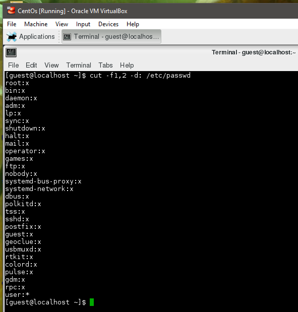
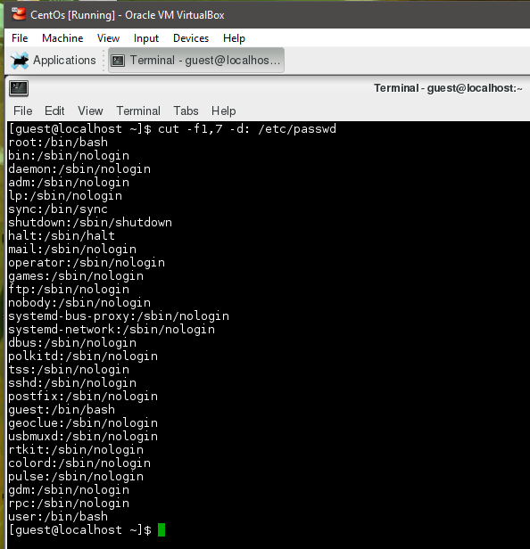
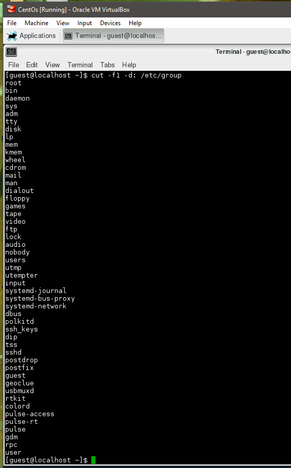
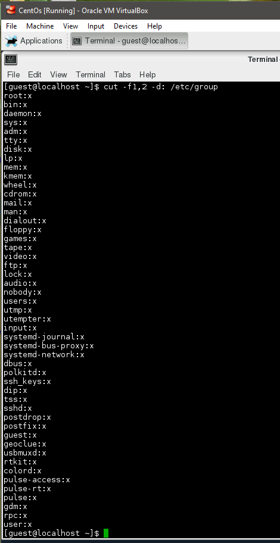

**shadow :**

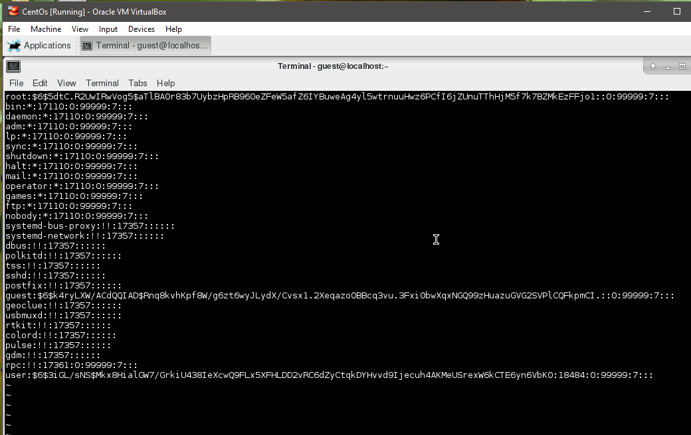

Shadow is a file which contains the password information for the system's accounts and optional aging information. Each line of this file contains 9 fields, separated by ":".
login name:encrypted password:date of last password change:minimum password age:maximum password age:password warning period:password inactivity perion:account expiration date:reserved field

**script execution :**

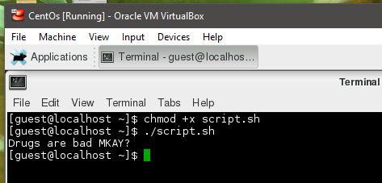

**User cannot access testDir :**

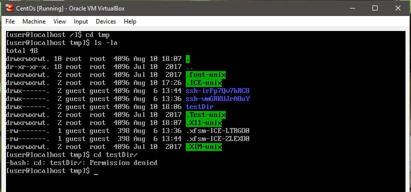

**Owner of the folder cannot access it :**

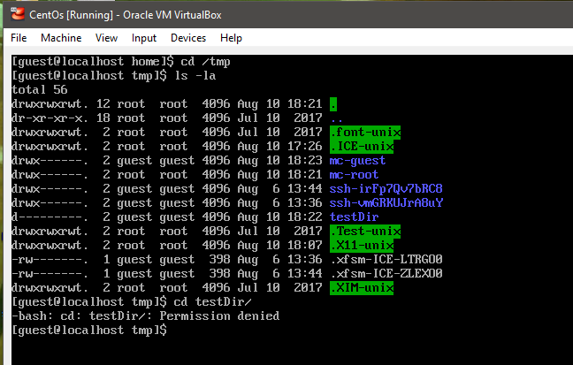
