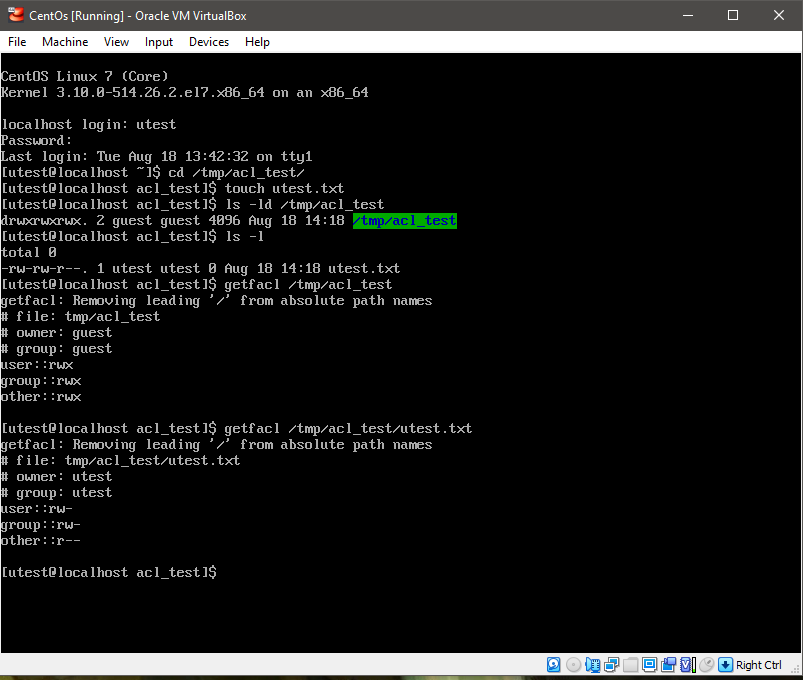
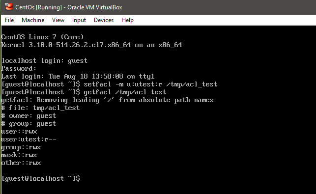
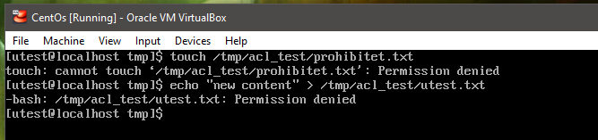
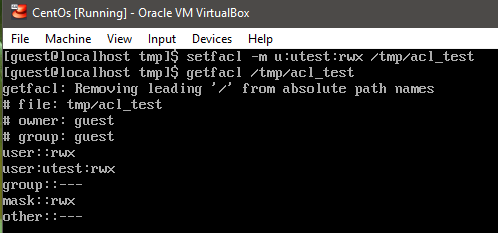
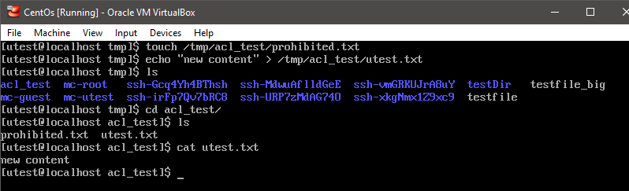
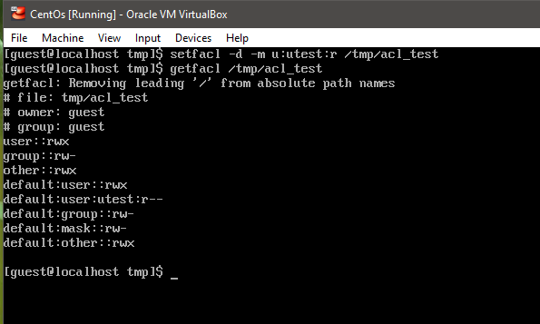
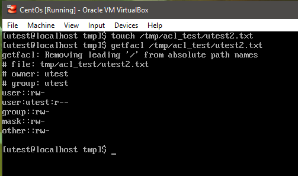
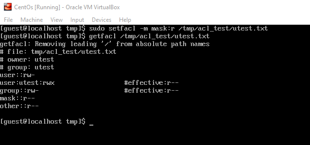
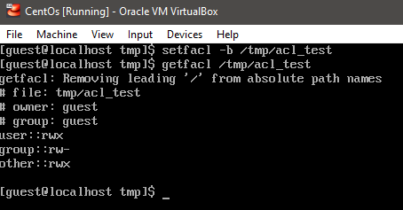

## Task 5.6

**Creating 'utest.txt' as 'utest' user, and cheking ACL permissions:**

**Applying ACL restrictions:**

**Testing restrictions:**

**Reverse situation with restricted convensional permissions and max ACL permissions:**

**Results : ACL has more priority**

**Deffault permissions :**

**Permissions for 'utest2.txt':**

**Mask with read-only permissions:**

**All ACL entries removed:**

