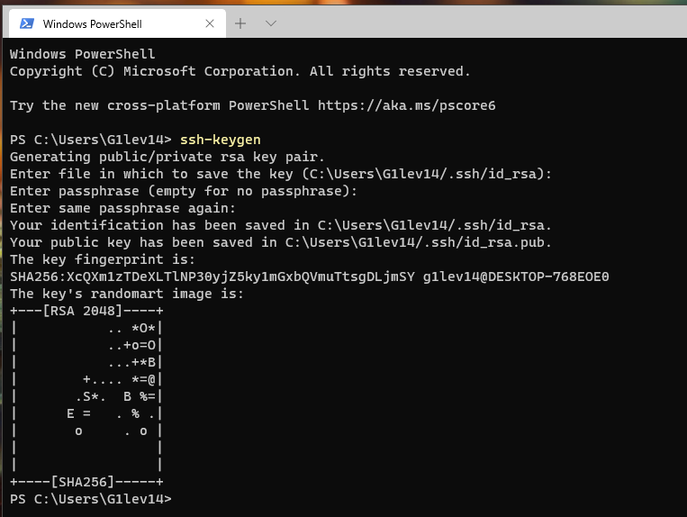
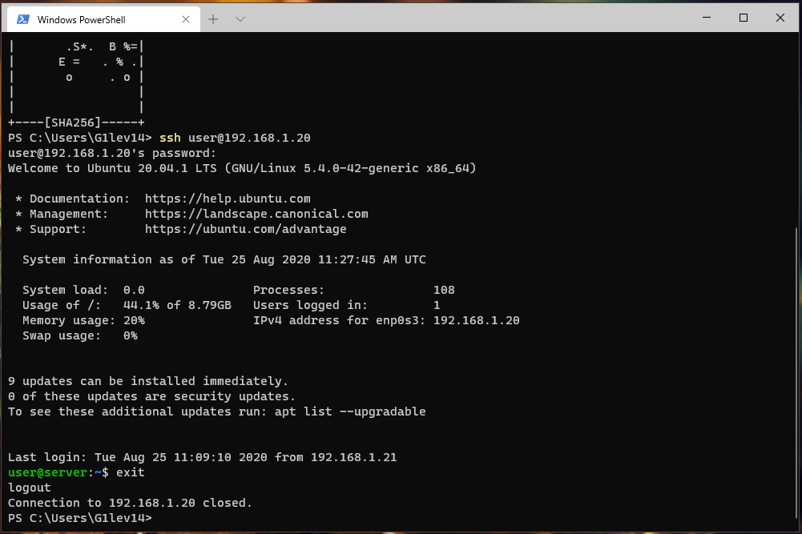
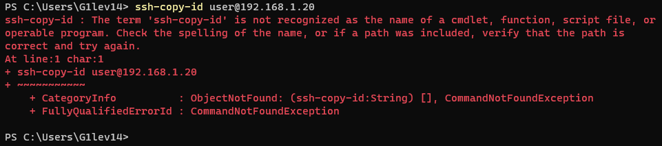
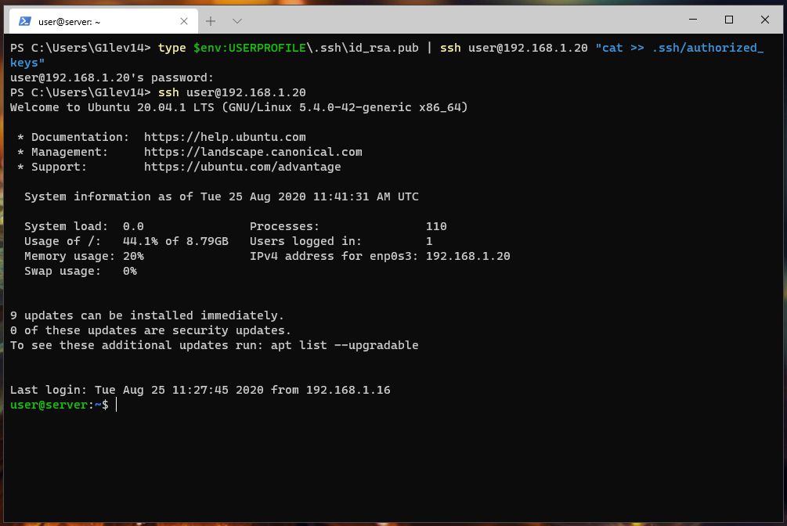
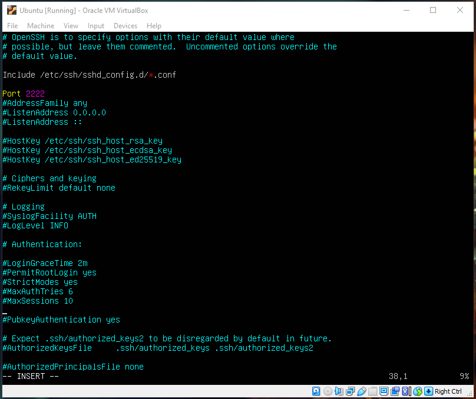
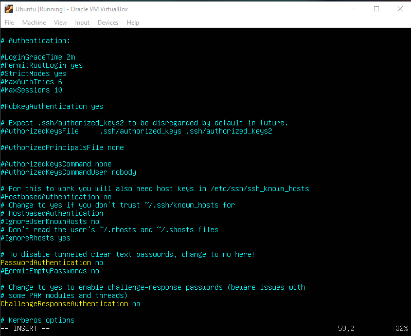
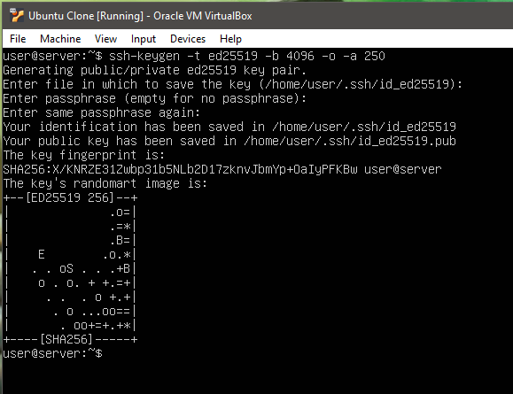
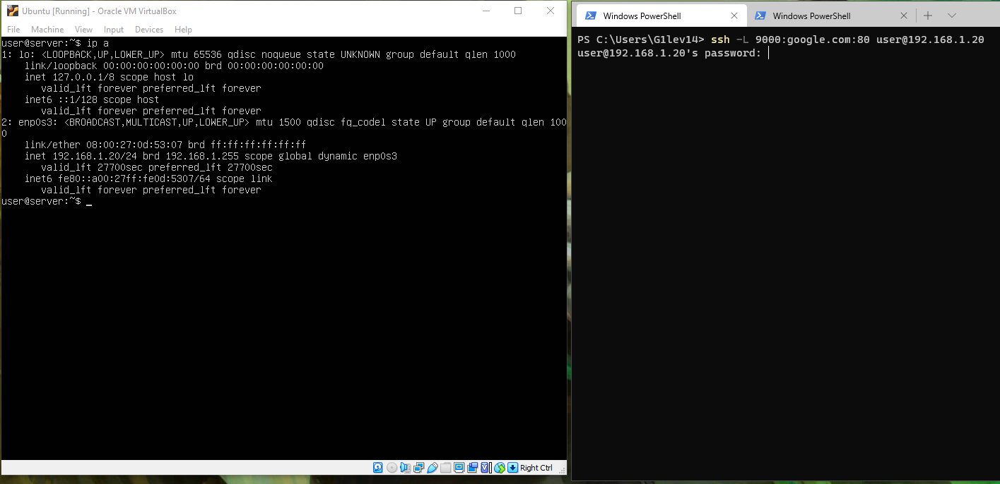
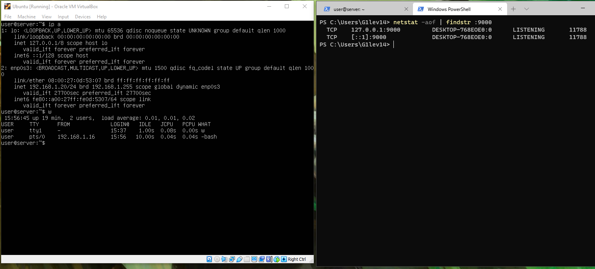

## Task 5.7

**OPENSSH on win10:**

`ssh-keygen` - creating new authentication key pairs for SSH.

`ssh` - connect to the remote server.

`ssh-copy-id` - installs an SSH key on a server as an authorized key.
As seen on the screenshot above this command is not implemented in win10, so we need to use some workarounds :

**Basic SSH settings for increased security:**

Changing default port, disable root login, disadle login with password.

**More secure SSH key:**

Using the Edwards Twisted Curve algorithm instead of rsa. Using 4096 bit key. We run 250 encryption rounds on the private key.

**Port forwarding:**

