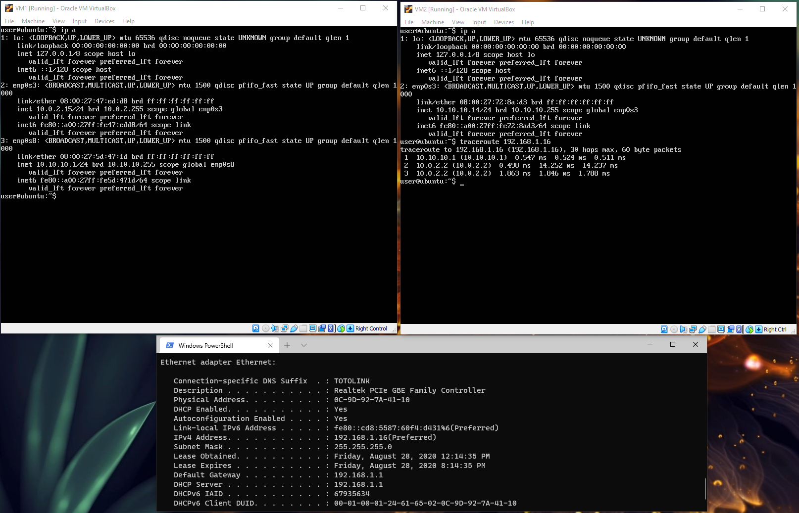
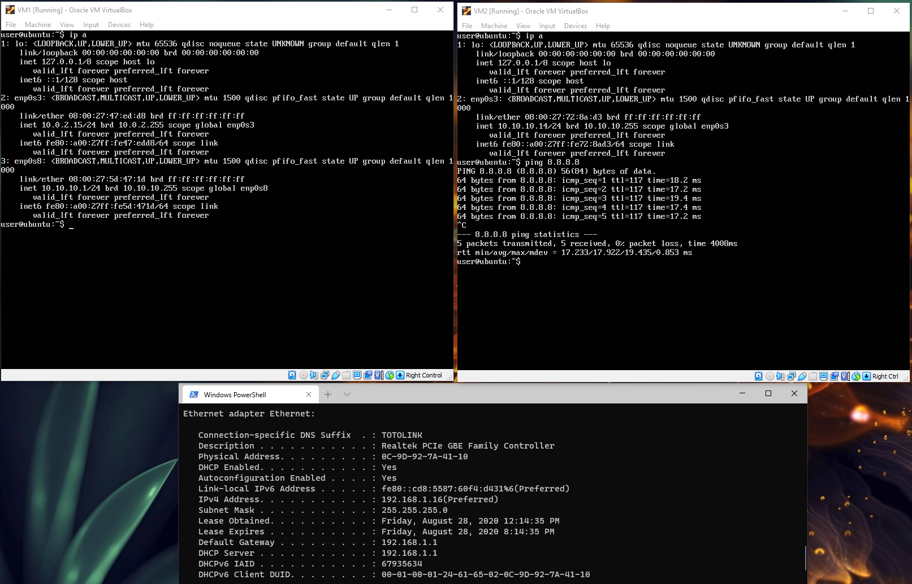
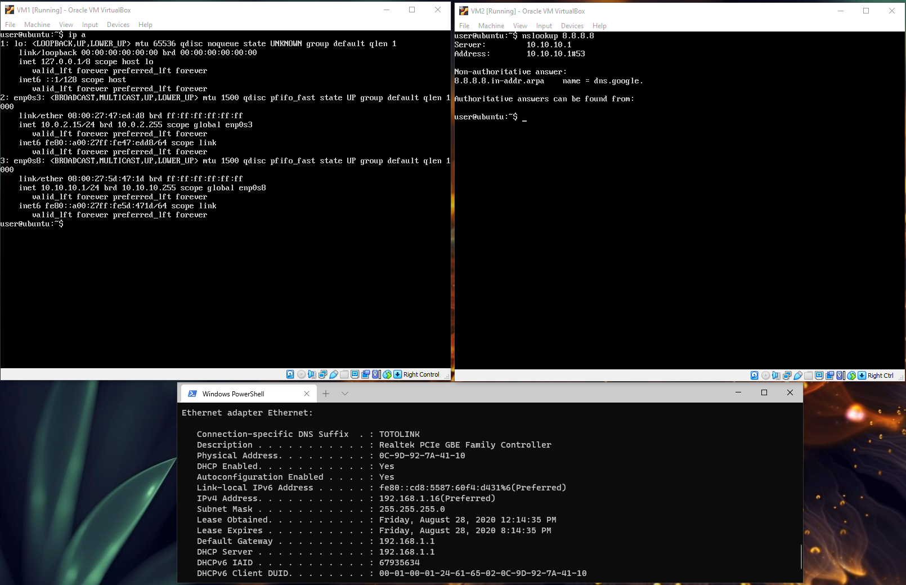
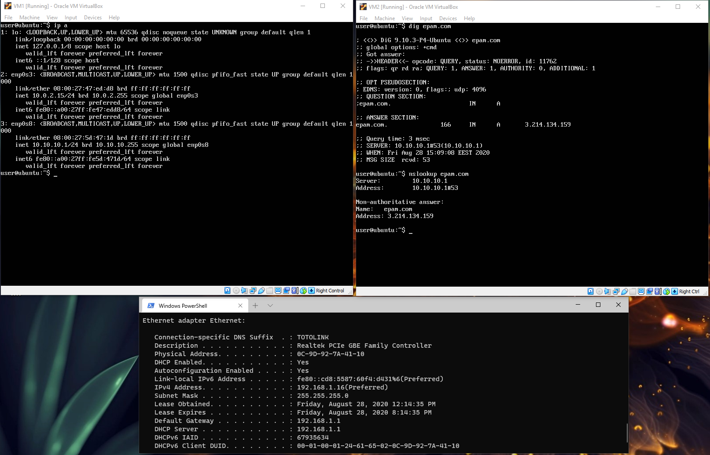
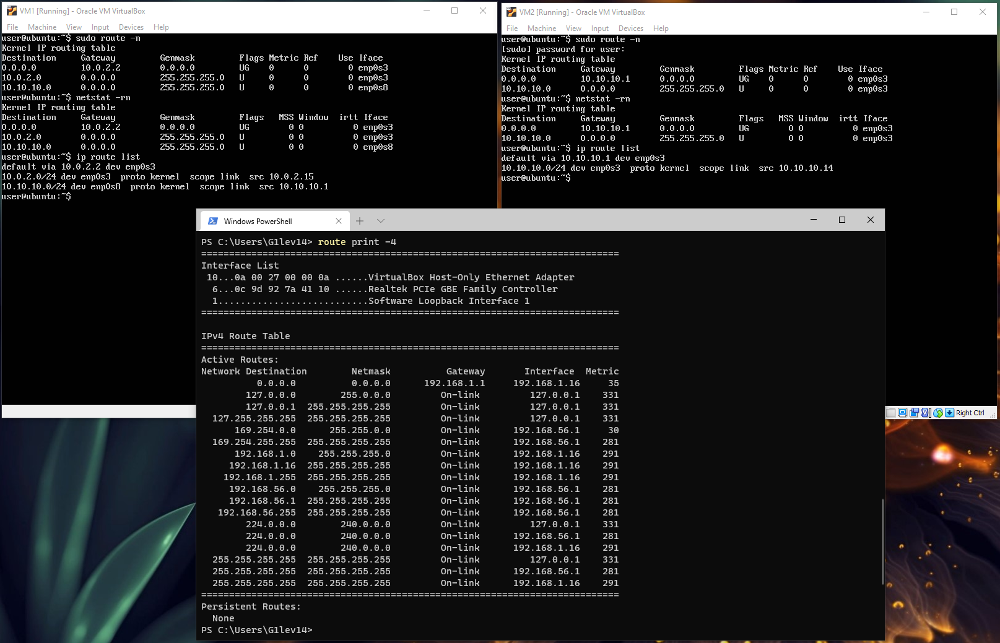
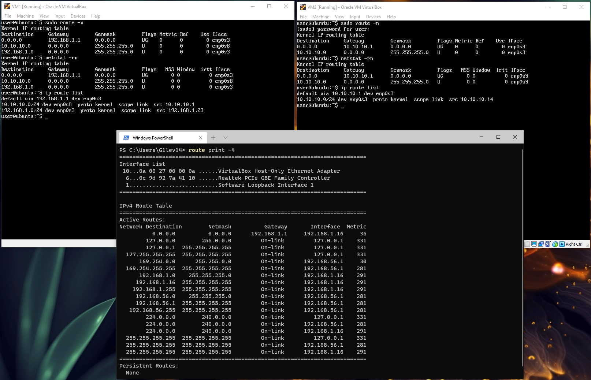
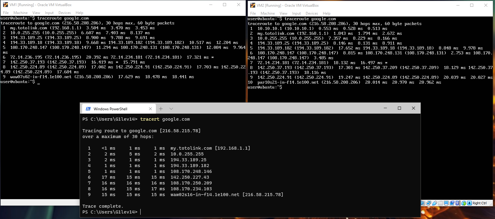

## Task 6.1

**Configuration, traceroute from VM2 to HOST:**

**Access to the internet:**

**Mysterious 8.8.8.8:**

**epam.com IP:**

**Routing(NAT):**

**Routing(BRIDGED):**

**Trace route to `google.com:`**

For demonstration purpose network adapter configuration of VM1 has been changed from NAT to BRIDGED (othervise traceroute to `google.com` shows `*` on each hop)