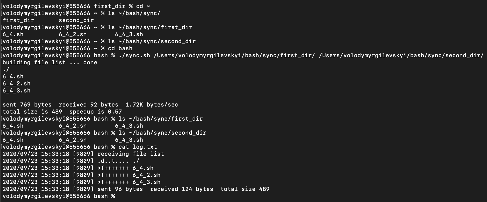
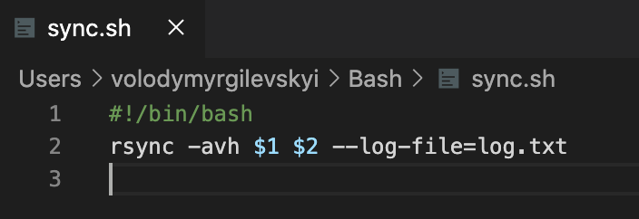
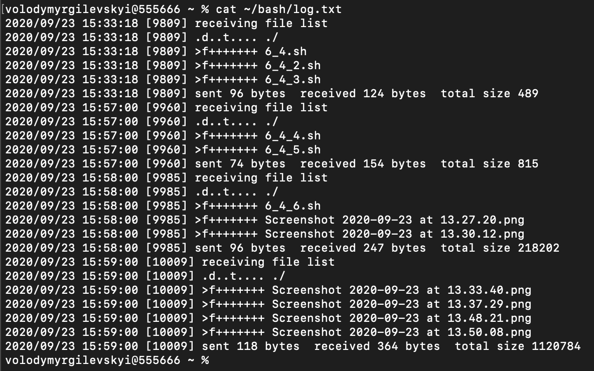

## Task 6.5

**Demonstration:**

We have two folders: `first_dir` and `second_dir`. The first one is the source, the second one is the target where backups should be stored. As shown on the screenshot first has some content, the second one is empty. Running script with 2 parameters which are paths to both folders. Checking the second folder, it has all the same files as the first one. Logs are saved in `log.txt`.

**Script:**

**Cron job:**

**Log file after couple runs:**

